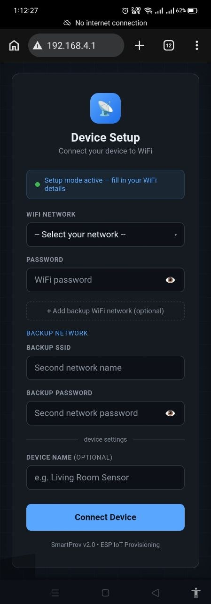

# SmartProv

A captive-portal Wi-Fi provisioning library for ESP32 and ESP8266.

SmartProv eliminates hardcoded Wi-Fi credentials. On first boot the device starts an Access Point and serves a mobile-friendly setup page. The user selects a network, enters credentials, and the device stores them to flash and connects automatically on every subsequent boot.

## Portal Preview



## Features

- Captive portal with automatic redirect on Android, iOS, and Windows
- Wi-Fi network scan with signal strength, lock icons, and duplicate filtering
- Multi-network support — save up to 3 networks with automatic fallback
- Wrong-password detection — immediately re-opens the portal instead of retrying
- Custom form fields API — add project-specific config fields to the setup form
- Persistent storage — ESP32 uses NVS (Preferences), ESP8266 uses EEPROM
- Factory reset via hardware button (hold GPIO0 for 3 seconds while connected)
- LED status indicator — fast blink: setup mode, slow blink: connecting, solid: connected
- Non-blocking state machine — never blocks `loop()`

## Supported Platforms

- ESP32
- ESP8266 / NodeMCU

## Installation

**Arduino IDE (recommended):**

1. Download the latest `SmartProv_vX.Y.Z.zip` from the [Releases](https://github.com/masud744/SmartProv/releases) page.
2. In Arduino IDE: `Sketch → Include Library → Add .ZIP Library...`
3. Select the downloaded zip.

**Arduino Library Manager:**
Search for `SmartProv` in `Tools → Manage Libraries...`

## Quick Start

```cpp
#include <SmartProv.h>

SmartProv prov;

void setup() {
    Serial.begin(115200);
    prov.begin();
}

void loop() {
    prov.update();

    if (prov.isConnected()) {
        // Your application code here
    }
}
```

1. Flash to your device.
2. Connect to the `SmartProv_XXXX` Wi-Fi access point from your phone or PC.
3. The setup portal opens automatically. Enter your Wi-Fi credentials.
4. The device restarts and connects. On subsequent boots it connects automatically.

To reset credentials, hold the reset button (GPIO0) for 3 seconds while connected.

## API Reference

### Initialisation

```cpp
prov.begin();                          // Default pins (reset=0, LED=2)
prov.begin(resetPin, ledPin);          // Custom pins
```

### Status

```cpp
prov.isConnected()     // true when connected to Wi-Fi
prov.isSetupMode()     // true when AP is active
prov.getIP()           // Current IP address
prov.getSSID()         // Connected network name
prov.getDeviceName()   // Device name set during provisioning
prov.getRSSI()         // Signal strength in dBm
prov.getMACAddress()   // Device MAC address
```

### Custom Fields

Add project-specific fields to the setup form. Must be called before `begin()`.

```cpp
prov.addField("api_key",    "API Key",    "Enter your API key");
prov.addField("server_url", "Server URL", "http://example.com");
prov.begin();

// After provisioning and reboot:
String key = prov.getField("api_key");
```

### Callbacks

```cpp
prov.onConnected([]() {
    // Called once when Wi-Fi connects
    Serial.println(prov.getIP());
});

prov.onLoop([]() {
    // Called every loop() while connected
});
```

### Factory Reset

```cpp
prov.resetCredentials();  // Erases flash and restarts into setup mode
```

### Customisation Macros

Define these before `#include <SmartProv.h>`:

```cpp
#define SP_AP_PREFIX        "MyDevice"   // AP name prefix  (default: "SmartProv")
#define SP_RESET_PIN        0            // Factory reset pin (default: 0)
#define SP_LED_PIN          2            // Status LED pin    (default: 2)
#define SP_RESET_HOLD_MS    5000         // Reset hold time   (default: 3000 ms)
#define SP_RESTART_DELAY_MS 2000         // Post-save delay   (default: 3000 ms)
#define SP_DEBUG                         // Enable verbose Wi-Fi status logging
```

## Architecture

```
SmartProv.h       Public API and state machine
SP_WiFi.h         Wi-Fi scanning, STA connection, AP management
SP_Server.h       HTTP server, DNS redirector, captive portal HTML
SP_Storage.h      Flash persistence (NVS / EEPROM)
```

---

## Author

Shahriar Alom Masud  
B.Sc. Engg. in IoT & Robotics Engineering  
University of Frontier Technology, Bangladesh  
Email: shahriar0002@std.uftb.ac.bd  
LinkedIn: https://www.linkedin.com/in/shahriar-alom-masud

---

## License

MIT License. See [LICENSE](LICENSE).
