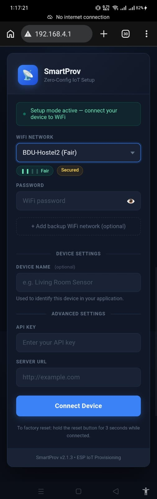

# SmartProv

> **Zero-Config IoT Setup — Captive-portal Wi-Fi provisioning for ESP32 and ESP8266.**

SmartProv eliminates hardcoded Wi-Fi credentials from your firmware. On first boot, the device starts an Access Point and serves a mobile-friendly setup page directly from the microcontroller. The user selects a network, enters credentials, and the device stores them to flash — connecting automatically on every subsequent boot. No app, no cloud, no pairing code required.

---

## Portal Preview



---

## Why SmartProv?

Most embedded Wi-Fi projects start with hardcoded credentials:

```cpp
WiFi.begin("MyNetwork", "password123");
```

This works on your desk. It breaks the moment you deploy a device to a client, a different location, or a product that needs to be reconfigured in the field. Existing solutions like WiFiManager solve this but come with outdated UIs, limited extensibility, and poor mobile experience.

**SmartProv was built to fix that.**

| | WiFiManager | SmartProv |
|---|---|---|
| UI | Dated HTML form | Modern dark-theme portal |
| Multi-network fallback | No | Yes — up to 3 networks |
| Wrong-password detection | Retries 5x | Immediately re-provisions |
| Custom config fields | No | Yes — dynamic API |
| Backup network support | No | Yes |
| Signal strength display | No | Yes — bars + label |
| Platform support | ESP32 / ESP8266 | ESP32 / ESP8266 |
| Non-blocking loop | Partial | Full state machine |
| Arduino Library Manager | Yes | Yes |

---

## Use Cases

SmartProv is designed for any ESP32 or ESP8266 project that needs to be configured without reflashing firmware.

**Home Automation**
Deploy a temperature sensor, relay controller, or smart plug to any home network without touching the code. The end user configures WiFi through their phone browser.

**IoT Products**
Ship a physical product to a customer. On first power-on, they connect to the device AP, enter their WiFi credentials, and the device is live — just like a commercial smart home device.

**Data Loggers / Remote Sensors**
Deploy a weather station, soil moisture sensor, or power monitor to a field location. Use the backup network feature to store both a primary network and a mobile hotspot as fallback.

**Custom Field Configuration**
Beyond WiFi, SmartProv's `addField()` API lets you collect any project-specific configuration — API keys, server URLs, MQTT broker addresses, device names — all through the same setup portal, stored persistently in flash.

**Rapid Prototyping**
Skip the `Serial.println("change SSID here")` step entirely. Every prototype gets a proper provisioning flow from day one.

---

## How It Works

```
Power On
    |
    v
Load config from flash
    |
    +--[ Configured? ]--NO--> Start AP + Captive Portal
    |                              |
   YES                        User fills form
    |                              |
    v                         Save to flash
Try network 1                      |
    |                         Restart device
    +-- Connected? --YES--> Run application loop
    |
    +-- Wrong password? --> Try next network
    |                           |
    +-- All failed? ---------> Start AP + Captive Portal
```

**State machine transitions (Serial Monitor output):**

```
SmartProv v2.1.3
[SmartProv] Configured: YES
[SmartProv] Trying network: HomeWiFi
[SmartProv] State: 0 -> 1
[SmartProv] [WiFi] Connecting to: HomeWiFi
[SmartProv] [WiFi] Connected — IP: 192.168.1.42 | RSSI: -55 dBm
[SmartProv] State: 1 -> 2
[SmartProv] Connected — IP: 192.168.1.42 | RSSI: -55 dBm
```

**Wrong-password flow:**

```
[SmartProv] [WiFi] FAILED — authentication rejected (wrong password).
[SmartProv] Wrong password for: HomeWiFi
[SmartProv] Trying next network: MobileHotspot
[SmartProv] [WiFi] Connected — IP: 192.168.137.5 | RSSI: -48 dBm
```

**Factory reset:**

```
[SmartProv] Factory reset triggered via hardware button.
[Storage] Configuration cleared.
[SmartProv] State: 0 -> 3   (setup mode)
```

---

## Features

- Captive portal with automatic redirect on Android, iOS, and Windows
- Wi-Fi network scan with signal strength bars, Secured/Open badges, and duplicate filtering
- Multi-network support — save up to 3 networks with automatic fallback
- Wrong-password detection — re-opens the portal immediately instead of exhausting retries
- Custom form fields API — collect project-specific config through the same portal
- Persistent storage — ESP32 uses NVS (Preferences), ESP8266 uses EEPROM
- Factory reset via hardware button (hold GPIO0 for 3 seconds while connected)
- LED status indicator — fast blink: setup mode, slow blink: connecting, solid: connected
- Non-blocking state machine — never stalls `loop()`
- Connection status feedback — spinner, success confirmation, and error messages in the UI

---

## Supported Platforms

- ESP32
- ESP8266 / NodeMCU

---

## Installation

**Arduino Library Manager (recommended):**
Search for `SmartProv` in `Tools → Manage Libraries...`

**Manual ZIP install:**
1. Download the latest `SmartProv_vX.Y.Z.zip` from the [Releases](https://github.com/Masud744/SmartProv/releases) page.
2. In Arduino IDE: `Sketch → Include Library → Add .ZIP Library...`
3. Select the downloaded zip.

---

## Quick Start

```cpp
#include <SmartProv.h>

SmartProv prov;

void setup() {
    Serial.begin(115200);
    prov.begin();
}

void loop() {
    prov.update();

    if (prov.isConnected()) {
        // Your application code here
    }
}
```

1. Flash to your device.
2. Connect to the `SmartProv_XXXX` Wi-Fi access point from your phone or PC.
3. The setup portal opens automatically. Select your network and enter credentials.
4. The device restarts and connects. On subsequent boots it connects automatically.

To reset credentials: hold GPIO0 for 3 seconds while connected.

---

## Advanced Example

This example demonstrates custom configuration fields, callbacks, and a custom AP name — suitable for a real IoT product deployment.

```cpp
#define SP_AP_PREFIX     "WeatherNode"
#define SP_RESET_HOLD_MS 5000

#include <SmartProv.h>

SmartProv prov;

void onConnected() {
    Serial.println("[App] Connected.");
    Serial.printf("[App] Device     : %s\n", prov.getDeviceName().c_str());
    Serial.printf("[App] Network    : %s\n", prov.getSSID().c_str());
    Serial.printf("[App] IP         : %s\n", prov.getIP().c_str());
    Serial.printf("[App] RSSI       : %d dBm\n", prov.getRSSI());

    // Read custom fields saved during provisioning
    String apiKey    = prov.getField("api_key");
    String serverUrl = prov.getField("server_url");

    Serial.printf("[App] API Key    : %s\n", apiKey.isEmpty() ? "(not set)" : apiKey.c_str());
    Serial.printf("[App] Server URL : %s\n", serverUrl.isEmpty() ? "(not set)" : serverUrl.c_str());
}

void appLoop() {
    static unsigned long lastSample = 0;
    if (millis() - lastSample < 10000) return;
    lastSample = millis();

    // Read sensor, POST to server, publish to MQTT, etc.
    Serial.printf("[App] RSSI: %d dBm\n", prov.getRSSI());
}

void setup() {
    Serial.begin(115200);

    // Register custom fields — appear in the portal under "Advanced Settings"
    prov.addField("api_key",    "OpenWeather API Key", "e.g. a1b2c3d4...");
    prov.addField("server_url", "Server URL",          "http://myserver.com/data");
    prov.addField("mqtt_host",  "MQTT Broker",         "broker.example.com");

    prov.begin();
    prov.onConnected(onConnected);
    prov.onLoop(appLoop);
}

void loop() {
    prov.update();

    // Factory reset via Serial: send 'R'
    if (Serial.available() && (Serial.read() == 'R')) {
        prov.resetCredentials();
    }
}
```

**Portal with custom fields active:**

The setup page will show an "Advanced Settings" section with inputs for API Key, Server URL, and MQTT Broker — all stored to flash alongside the Wi-Fi credentials and available via `prov.getField()` on every subsequent boot.

---

## API Reference

### Initialisation

```cpp
prov.begin();                    // Default pins (reset=GPIO0, LED=GPIO2)
prov.begin(resetPin, ledPin);    // Custom GPIO pins
```

### Status

```cpp
prov.isConnected()     // true when connected to Wi-Fi
prov.isSetupMode()     // true when AP is active
prov.getIP()           // Current IP address as String
prov.getSSID()         // Connected network name
prov.getDeviceName()   // Device name set during provisioning
prov.getRSSI()         // Signal strength in dBm (int32_t)
prov.getMACAddress()   // Device MAC address as String
prov.getAPName()       // Current AP name (during setup mode)
```

### Custom Fields

```cpp
// Register before begin() — renders in the portal under "Advanced Settings"
prov.addField("key",   "Label",        "Placeholder text");

// Read after provisioning and reboot
String value = prov.getField("key");
```

### Callbacks

```cpp
prov.onConnected([]() {
    // Called once on the first successful connection
});

prov.onLoop([]() {
    // Called every update() cycle while connected
});
```

### Factory Reset

```cpp
prov.resetCredentials();    // Erase flash and restart into setup mode
// Or: hold GPIO0 LOW for SP_RESET_HOLD_MS milliseconds (default 3000)
```

### Customisation Macros

Define before `#include <SmartProv.h>`:

```cpp
#define SP_AP_PREFIX        "MyDevice"   // AP name prefix        (default: "SmartProv")
#define SP_RESET_PIN        0            // Factory reset GPIO     (default: 0)
#define SP_LED_PIN          2            // Status LED GPIO        (default: 2)
#define SP_RESET_HOLD_MS    5000         // Reset hold duration ms (default: 3000)
#define SP_RESTART_DELAY_MS 2000         // Post-save restart ms   (default: 3000)
#define SP_DEBUG                         // Verbose Wi-Fi logging
```

---

## Architecture

```
SmartProv.h     Public API and provisioning state machine
SP_WiFi.h       Wi-Fi scanning, STA connection, AP management, wrong-password detection
SP_Server.h     HTTP server, DNS redirector, captive portal HTML/CSS/JS
SP_Storage.h    Flash persistence — NVS on ESP32, EEPROM on ESP8266
```

---

## What You Can Build With SmartProv

| Project | What SmartProv provides |
|---|---|
| Smart plug / relay | Field WiFi setup + device naming |
| Weather station | WiFi + API key + server URL via portal |
| MQTT sensor node | WiFi + MQTT broker address via portal |
| Asset tracker | Primary WiFi + mobile hotspot backup |
| Commercial IoT product | End-user provisioning without app or reflash |
| Multi-site data logger | Per-device network config stored in flash |
| Smart irrigation controller | On-site WiFi setup by non-technical user |

---

## Author

**Shahriar Alom Masud**  
B.Sc. Engg. in IoT & Robotics Engineering  
University of Frontier Technology, Bangladesh  
Email: shahriar0002@std.uftb.ac.bd  
LinkedIn: [linkedin.com/in/shahriar-alom-masud](https://www.linkedin.com/in/shahriar-alom-masud)

---

## License

MIT License. See [LICENSE](LICENSE).
